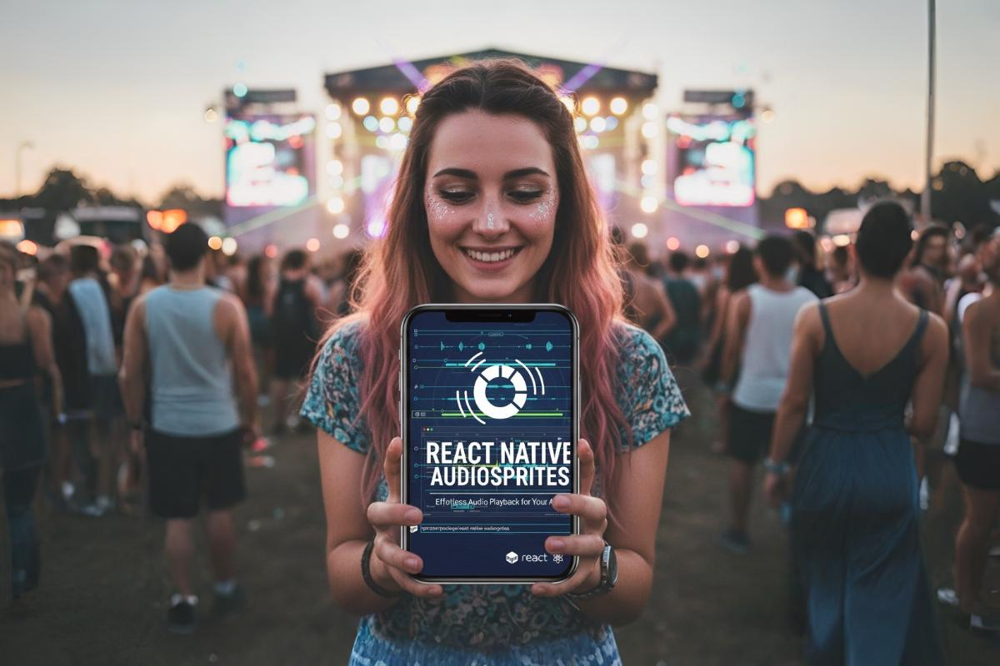

# react-native-audiosprites

A universal player for audio sprites generated by the 'audiosprite' tool.
Supports playing multiple sounds at same time!

## Installation

```sh
npm install react-native-audiosprites
```

```sh
yarn add react-native-audiosprites
```

## Usage

First, you need to generate an audio sprite and a JSON manifest file using the `audiosprite` tool.

Assuming you have [`audiosprite`](https://www.npmjs.com/package/audiosprite) installed globally:

```sh
audiosprite --output src/__tests__/sounds/mygameaudio --format howler --loop "bg_loop" src/__tests__/sounds/bg_loop.wav src/__tests__/sounds/Sound_1.m4a src/__tests__/sounds/Sound_2.m4a src/__tests__/sounds/Sound_3.m4a src/__tests__/sounds/Sound_4.m4a
```

This command will generate `mygameaudio.json`, `mygameaudio.mp3`, `mygameaudio.ogg`, `mygameaudio.m4a`, and `mygameaudio.ac3` in the `src/__tests__/sounds/` directory.

### Looping Sounds

You can create looping sounds by using the `--loop` option with the `audiosprite` command. The value of the `--loop` option should be the name of the sound you want to loop.

For example, to loop the `bg_music` sound, you would use the following command:

```sh
audiosprite --output audiosprite --format howler --loop "bg_music" --path ./src/__tests__/ Sound_1.m4a Sound_2.m4a Sound_3.m4a Sound_4.m4a bg_music.wav
```

When you play a looping sound, it will play continuously until you stop it. The looping functionality is supported on both web and mobile platforms.

Then, you can use the `AudioSpritePlayer` to play the sounds from the sprite.

### Browser Environment

```typescript
import { AudioSpritePlayer } from 'react-native-audiosprites';

const player = new AudioSpritePlayer({
  platform: 'web',
});

async function playSound(soundName: string) {
  try {
    // Load the audio sprite manifest and audio files
    // Adjust the path to your audiosprite.json file
    await player.load('./src/__tests__/sounds/mygameaudio.json');
    console.log('Audio sprite loaded successfully.');

    // Play a sound from the spritemap
    player.play(soundName);
    console.log(`Playing sound: ${soundName}`);
  } catch (error) {
    console.error('Error playing sound:', error);
  }
}

// Example usage:
playSound('Sound_1');
// playSound('Sound_2');
```

### React Native Environment

For React Native, you'll need `react-native-audio-api` and `expo-asset` to handle audio playback and asset loading.

First, install the dependencies:

```sh
npm install react-native-audio-api expo-asset expo-file-system
# or
yarn add react-native-audio-api expo-asset expo-file-system
```

Change `metro.config.js` as per `react-native-audio-api` documentation: https://docs.swmansion.com/react-native-audio-api/docs/fundamentals/getting-started

```js
module.exports = wrapWithAudioAPIMetroConfig(config);
```

Then, you can use it in your component:

```typescript
import { StyleSheet, View, Text, Button, Platform } from 'react-native';
import { AudioSpritePlayer } from 'react-native-audiosprites';
import { AudioManager, AudioContext } from 'react-native-audio-api';
import { useEffect, useState, useRef } from 'react';
import { Asset } from 'expo-asset';
import { fetch } from 'expo/fetch';
import manifest from '../assets/mygameaudio.json';

// Import the audio asset
const audioAsset = require('../assets/mygameaudio.mp3');

export default function App() {
  const [isLoaded, setIsLoaded] = useState(false);
  const playerRef = useRef<AudioSpritePlayer | null>(null);

  useEffect(() => {
    const loadPlayer = async () => {
      const asset = Asset.fromModule(audioAsset);
      await asset.downloadAsync();
      const audioUri = asset.localUri || asset.uri;

      if (!audioUri) {
        console.error('Failed to get audio URI.');
        return;
      }

      if (Platform.OS === 'ios') {
        try {
          await AudioManager.setAudioSessionOptions({
            iosCategory: 'playback',
            iosOptions: ['mixWithOthers'],
          });
          await AudioManager.setAudioSessionActivity(true);
        } catch (e) {
          console.error('Failed to configure AudioSession options:', e);
        }
      }

      const audioContext = new AudioContext();
      const audioPlayer = new AudioSpritePlayer({
        audioContext,
        fetch: fetch.bind(globalThis),
        platform: Platform.OS,
      });

      try {
        await audioPlayer.load(manifest, audioUri);
        playerRef.current = audioPlayer;
        setIsLoaded(true);
        console.log('Audio sprite loaded successfully.');
      } catch (error) {
        console.error('Failed to load audio sprite:', error);
      }
    };

    loadPlayer();
  }, []);

  const playSound = (soundName: string) => {
    const player = playerRef.current;
    if (player && isLoaded) {
      player.play(soundName);
      console.log(`Playing sound: ${soundName}`);
    } else {
      console.warn('Player not loaded yet.');
    }
  };

  return (
    <View style={styles.container}>
      <Text>AudioSprite Player Example</Text>
      <Button
        title="Play Sound 1"
        onPress={() => playSound('Sound_1')}
        disabled={!isLoaded}
      />
      <Button
        title="Play Sound 2"
        onPress={() => playSound('Sound_2')}
        disabled={!isLoaded}
      />
      <Button
        title="Play Background Loop"
        onPress={() => playSound('bg_loop')}
        disabled={!isLoaded}
      />
    </View>
  );
}

const styles = StyleSheet.create({
  container: {
    flex: 1,
    alignItems: 'center',
    justifyContent: 'center',
  },
});
```

## Inspiration

https://github.com/goldfire/howler.js
Generated json also works with new Howl({
sprite: {
key1: [offset, duration, (loop)]
},
});

## Contributing

- [Development workflow](CONTRIBUTING.md#development-workflow)
- [Sending a pull request](CONTRIBUTING.md#sending-a-pull-request)
- [Code of conduct](CODE_OF_CONDUCT.md)

## License

MIT

## Credits

---

<a href="https://freesound.org/people/kwazi/sounds/34115/">Shaker, Woda, Conga, Bongo, Templeblock.wav</a> by <a href="https://freesound.org/people/kwazi/">kwazi</a> | License: <a href="http://creativecommons.org/licenses/by/3.0/">Attribution 3.0</a>

Made with [create-react-native-library](https://github.com/callstack/react-native-builder-bob)
